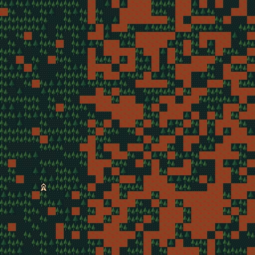
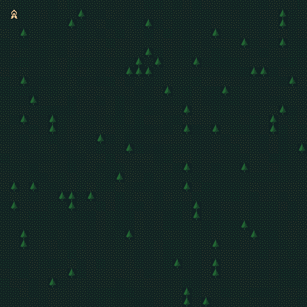

SRF: Simple Roguelike Framework
-------------------------------

An experiment in node.js-style game programming, using C++ and Lua.

At this point, SRF contains:
* Fast tilemap rendering
* Input handling
* Timer events
* Single file, key-value storage

In the future, SRF will hopefully contain:
* Audio playback
* Coherent noise generation
* TTF Rendering
* Post-render effects

Various screenshots ( featuring outstanding tiles by [MCNoodlor](https://twitter.com/MCNoodlor) ):

