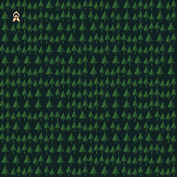

SRF: Simple Roguelike Framework
-------------------------------

An experiment in node.js-style game programming, using C++ and lua.

The tileset is the fantastic work of [MCNoodlor](https://twitter.com/MCNoodlor).

